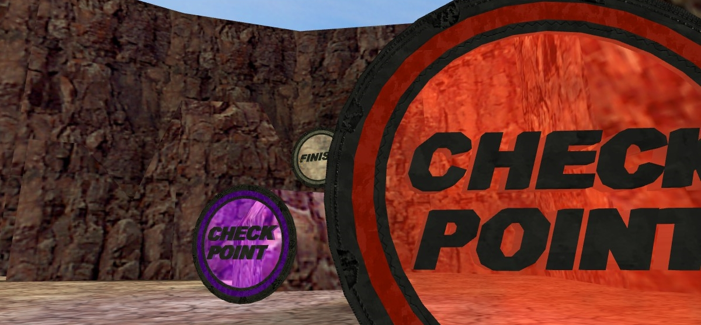

# Checkpoints

_**English** | [Русский](README.ru.md)_



AMX Mod X plugin for Counter-Strike.

The plugin adds special checkpoints, after passing through which, the player will be able to start directly from a given position in case of his death (if respawn is possible)) and/or receive a money reward for completing them.

The plugin includes:
* One checkpoint model - 256 possible colors. You can turn on smooth transfusion.
* Final checkpoint.
* Menu for placing checkpoints.
* Support [DeathrunMod](https://github.com/Mistrick/DeathrunMod) Duels.

### Demonstration video
[](https://youtu.be/InHb46OcwFo)

## Configuration
### Cvars
- ```n21_checkpoint_reward "300"``` Reward for passing the checkpoint.
- ```n21_checkpoint_money_mul "1"``` Whether to multiply the money reward by the checkpoint number.
- ```n21_checkpoint_money_last_first "6000"``` Reward for passing the last checkpoint to the first player.
- ```n21_checkpoint_money_last_second "4000"``` Reward for passing the last checkpoint to the second player.
- ```n21_checkpoint_money_last_third "3500"``` Reward for passing the last checkpoint to the third player.
- ```n21_checkpoint_teleport "0"``` Whether to teleport the player to the last passed checkpoint during respawn.
- ```n21_checkpoint_skip_limit "0"``` How many checkpoints the player is allowed to skip, otherwise teleport him to the last passed checkpoint or respawn.
- ```n21_checkpoint_light_effect "0"``` Whether to highlight checkpoints.
- ```n21_checkpoint_glow_effect "0.0"``` The size of the glow aura at the checkpoint (0.0 - disables the effect).

### Definitions
The configuration is done in the source file:
```c
#define MAX_CHECKPOINTS				32 // Maximum checkpoints on the map
#define CHECKPOINT_RADIUS			45.0 // Checkpoint radius (not models)
#define ACCESS_FLAG			ADMIN_MAP // Access flag for the checkpoint placement menu
#define COLOR_EFFECT 		// The effect of the overflow of the checkpoint colors (to disable, delete or comment out)
// #define DUELS_ENABLED 	// Disables checkpoints during a duel (uncomment for duel support)
```

## Requirements
- [Reapi](https://github.com/s1lentq/reapi)

## Authors
- [Psycrow](https://github.com/Psycrow101)
